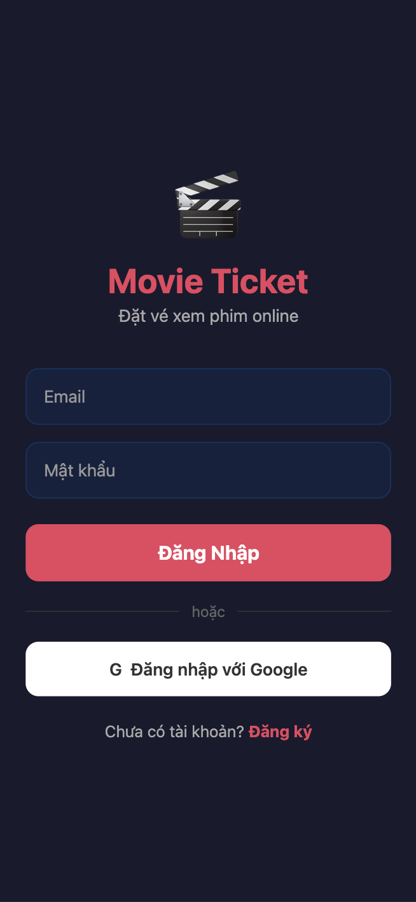
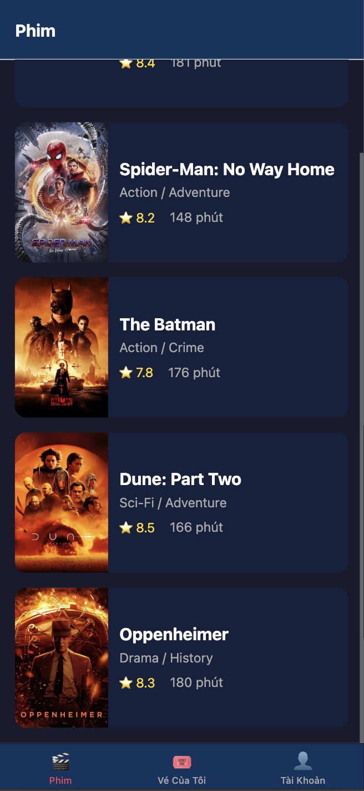
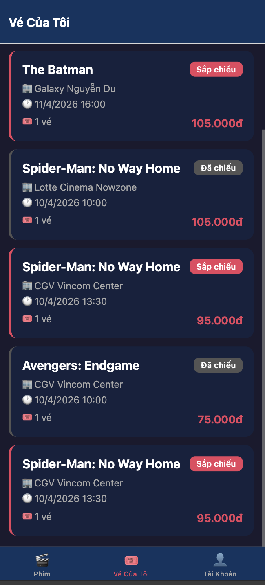

# Movie Ticket App

Ung dung dat ve xem phim online - React Native (Expo) + Firebase

## Chuc nang

- Dang nhap / Dang ky (Email + Google)
- Danh sach phim voi poster, rating, the loai
- Chi tiet phim + suat chieu theo ngay/rap
- Dat ve voi chon so luong ghe, tinh tong tien
- Xem ve da dat (Sap chieu / Da chieu)
- Thong bao nhac truoc gio chieu (push notification)
- Trang tai khoan voi thong tin user

## Tech Stack

- React Native (Expo SDK 52)
- TypeScript
- Firebase Auth (Email/Password + Google Sign-In)
- Cloud Firestore
- expo-notifications

## Screenshots

| Dang Nhap | Danh Sach Phim |
|:-:|:-:|
|  |  |

| Ve Cua Toi | Tai Khoan |
|:-:|:-:|
|  |  |

## Cai dat

```bash
cd mobile
npm install
npm start
```

## Firestore Collections

- `users` - Thong tin nguoi dung
- `movies` - Danh sach phim
- `theaters` - Rap chieu phim
- `showtimes` - Suat chieu (lien ket movie + theater)
- `tickets` - Ve da dat (lien ket user + showtime)
